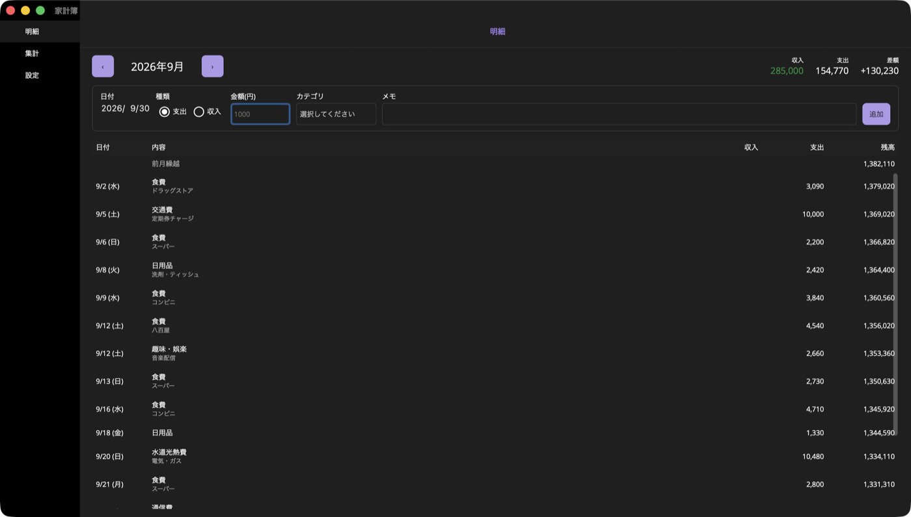
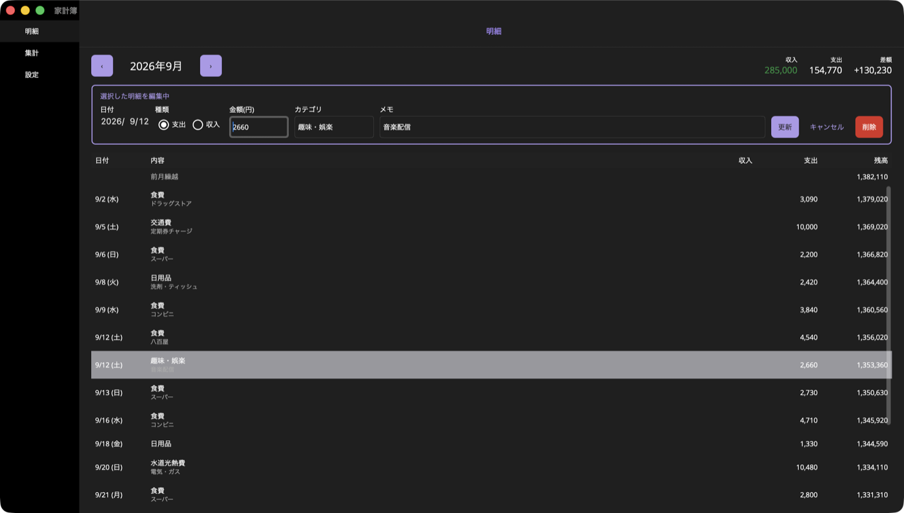
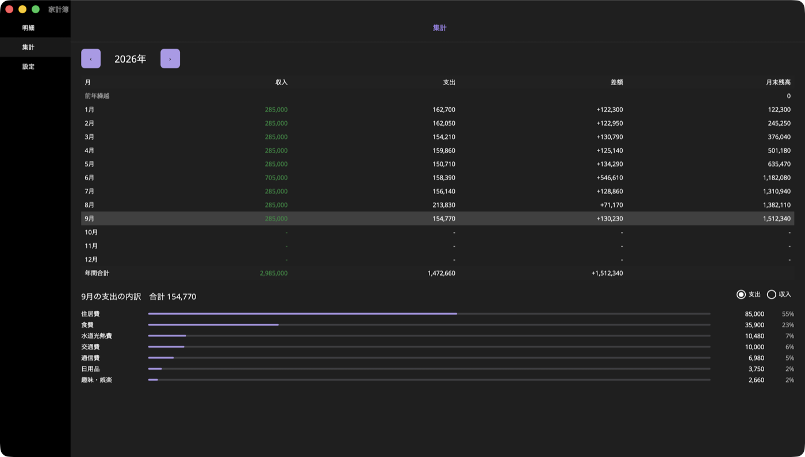
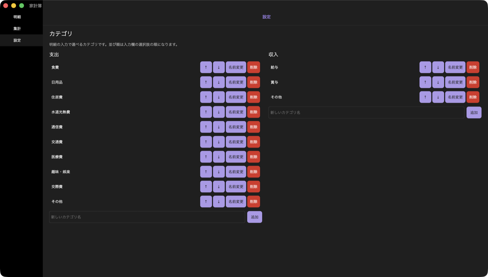

# 家計簿

[English](README.md) | 日本語

個人開発の家計簿アプリです。明細を記録し、月ごとの収支やカテゴリ別の内訳を確認できます。

現在はデスクトップ版(macOS / Windows)をオフラインで動かすところまでできています。ログインとクラウド同期、Web 版はこれから作ります。

- [アーキテクチャ](docs/architecture.ja.md): 全体構成、データ設計、決定事項と未決事項
- [ユビキタス言語](docs/ubiquitous-language.ja.md): 用語集



## 機能

- 明細(日付・支出/収入・金額・カテゴリ・メモ)の追加・編集・削除
- 月ごとの明細を、前月繰越からの残高つきの帳簿形式で表示
- 年ごとの月別推移(収入・支出・差額・月末残高)と、月のカテゴリ別内訳
- カテゴリの追加・名前変更・並べ替え・削除

## 使い方

画面左のサイドバーで「明細」「集計」「設定」を切り替えます。

### 明細を記録する

1. サイドバーで **明細** を選ぶ
2. 上部の入力欄に、日付・支出/収入・金額・カテゴリ・メモを入れる
   - 日付は、表示中の月が今月なら今日、それ以外の月ならその月の 1 日が入っています
   - カテゴリは、支出/収入の選択に合わせた選択肢から選びます
   - メモは空でもかまいません
3. **追加** を押す(金額・メモの欄で Enter キーを押しても追加できます)

追加すると、日付と支出/収入はそのままで、ほかの欄が空に戻ります。続けて次の明細を入力できます。
表示中とは別の月の日付で追加すると、その月の表示に切り替わります。

### 明細を直す・消す

1. 一覧で直したい明細をクリックする
2. 入力欄に明細の内容が入り、枠が色つきになる(編集中)
3. 内容を直して **更新** を押す。消すときは **削除** を押す
4. 編集をやめるときは **キャンセル** を押す



削除した明細は元に戻せません。

### 月の収支を見る

明細画面では、`‹` `›` で表示する月を切り替えます。

- 右上に、その月の **収入**・**支出**・**差額**(収入 − 支出)が出ます。赤字の月は差額が赤く表示されます
- 一覧は日付の古い順に並び、**残高** は「前月繰越」から積み上げた額です

「残高」はアプリに記録した明細から計算した額です。財布や口座の実際の残高とは一致しないことがあります。

### 1 年の推移と内訳を見る

1. サイドバーで **集計** を選ぶ
2. `‹` `›` で表示する年を切り替える
3. 表の月をクリックすると、下にその月の **カテゴリ別の内訳** が出る。支出と収入を切り替えられる

まだ来ていない月は「-」で表示されます。



### カテゴリを整える

サイドバーで **設定** を選びます。支出用と収入用のカテゴリが並んでいます。

| 操作 | やり方 |
|---|---|
| 追加 | 一覧の下の欄に名前を入れて **追加** |
| 名前の変更 | **名前変更** を押して新しい名前を入れる。過去の明細の表示も変わります |
| 並べ替え | **↑** **↓** で動かす。入力欄の選択肢もこの順になります |
| 削除 | **削除** を押す。入力欄の選択肢から消えますが、登録済みの明細にはカテゴリ名が残ります |

初回起動時に、よく使うカテゴリ(食費、日用品、給与など)が登録されています。



### データの保存場所

データは端末の中(SQLite)に保存されます。まだクラウドには送られません。

| OS | 場所 |
|---|---|
| macOS | `~/Library/Containers/dev.redamoon.kakeibo.desktop/Data/Library/kakeibo.db3` |

## 開発環境

### 必要なもの(macOS)

| ツール | バージョン | 備考 |
|---|---|---|
| macOS | Apple Silicon | Xcode 27 が動くバージョン |
| Xcode | **27.0** | MAUI ワークロードと major.minor が一致している必要があります |
| .NET SDK | **10.0.401** 以降の 10.0.4xx | [ダウンロード](https://dotnet.microsoft.com/download/dotnet/10.0) |
| .NET MAUI ワークロード | **10.0.401.1** | `global.json` の `workloadVersion` で固定しています |

SDK とワークロードのバージョンは [global.json](global.json) で固定しています。

### セットアップ

```sh
git clone https://github.com/redamoon/kakeibo.git
cd kakeibo

# Xcode を指定し、ライセンスに同意する
sudo xcode-select -s /Applications/Xcode.app
sudo xcodebuild -license accept
sudo xcodebuild -runFirstLaunch

# MAUI ワークロードを入れ、global.json と同じバージョンにそろえる
sudo dotnet workload install maui
sudo dotnet workload update --version 10.0.401.1

# 確認(「global.json ... 10.0.401.1 を使用しています」と出れば OK)
dotnet workload list
```

### ビルドと実行

```sh
# Mac Catalyst 版をビルドして起動
dotnet build src/Kakeibo.Desktop -f net10.0-maccatalyst
open "src/Kakeibo.Desktop/bin/Debug/net10.0-maccatalyst/maccatalyst-arm64/家計簿.app"

# テスト(Core のみ。MAUI なしで動きます)
dotnet test tests/Kakeibo.Core.Tests
```

Windows 版(`net10.0-windows10.0.19041.0`)は Windows 上でのみビルドできます。Windows でのビルドはまだ確認していません。

### よくあるエラー

**`This version of .NET for MacCatalyst (x) requires Xcode y`**

Xcode とワークロードのバージョンが合っていません。MAUI の Mac Catalyst SDK は、Xcode の major.minor が完全に一致しないとビルドできません。

- `xcodebuild -version` で Xcode のバージョンを確認する
- Xcode を更新したら、それに合うワークロードのバージョンを `dotnet workload search version` で探し、`global.json` の `workloadVersion` と `sudo dotnet workload update --version <バージョン>` をそろえる

**`You have not agreed to the Xcode license agreements`**

Xcode を入れた直後や更新した直後に出ます。`sudo xcodebuild -license accept` を実行してください。

### プロジェクト構成

```
src/Kakeibo.Core/          ドメインとデータアクセス(MAUI に依存しない)
src/Kakeibo.Desktop/       .NET MAUI のデスクトップアプリ
tests/Kakeibo.Core.Tests/  Core の単体テスト
docs/                      設計ドキュメント
```

詳しくは [アーキテクチャ](docs/architecture.ja.md) を見てください。
