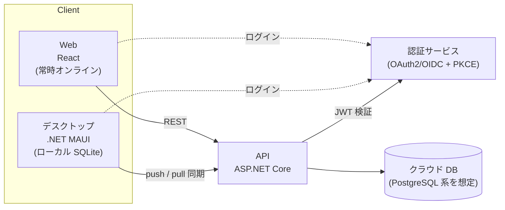
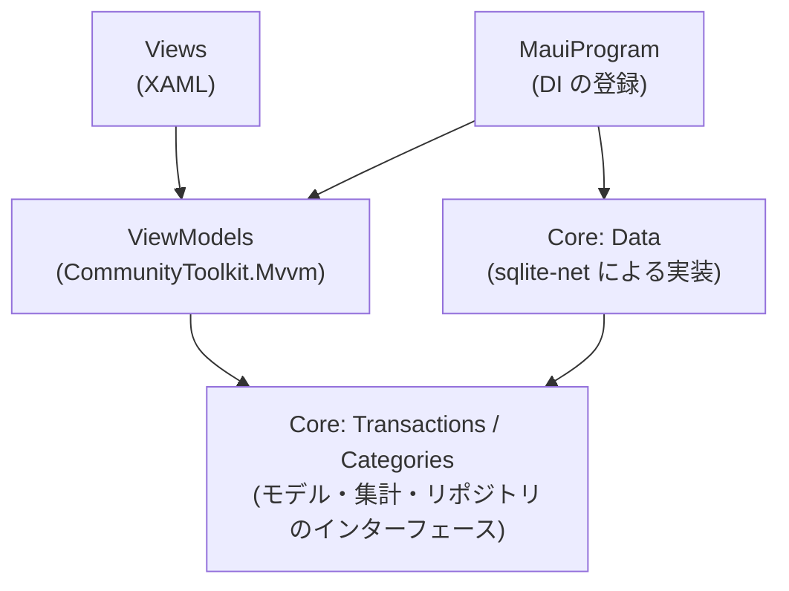
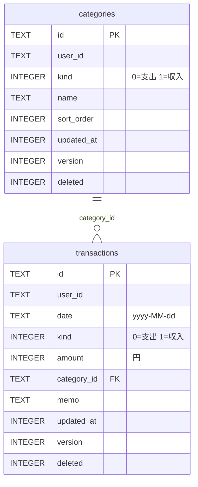

# アーキテクチャ

家計簿アプリの全体構成と設計上の決定事項をまとめる。用語は [ユビキタス言語](ubiquitous-language.md) に従う。

## 前提

- 個人開発で、当面は無料配布。有料化は後から追加する
- ログイン(アカウント)方式
- 開発環境は Mac

## 全体構成

最終的には次の構成を目指す。**現在実装済みなのはデスクトップ(オフライン動作)のみ**。



| 層 | 技術 | 役割 | 状態 |
|---|---|---|---|
| デスクトップ | C# / .NET 10 / .NET MAUI | ローカル SQLite で動作し、API と同期する | 実装中 |
| API | ASP.NET Core | 認証検証、CRUD、同期、集計 | 未着手 |
| クラウド DB | 未定(PostgreSQL 系を想定) | データの正 | 未着手 |
| Web | React | API を直接呼ぶ(常時オンライン前提) | 未着手 |

方針:

- API の契約は **OpenAPI** で定義し、C# と React のクライアントコードを自動生成する
- 集計などの重要な計算は **API 側に寄せ**、二重実装を避ける
- 同期ロジックは **デスクトップ側だけ** が持つ

## デスクトップアプリ

### 対象プラットフォーム

| OS | 対応 | 備考 |
|---|---|---|
| macOS | Mac Catalyst | 日常の確認用 |
| Windows | WinUI | GitHub Actions の Windows ランナーでビルドする予定(未確認) |
| Linux | 対象外 | MAUI が非対応 |
| iOS / Android | 未定 | 後で判断する |

### プロジェクト構成

```
Kakeibo.slnx
├── src/
│   ├── Kakeibo.Core/          ドメインとデータアクセス(MAUI に依存しない)
│   │   ├── Accounts/          利用者(ICurrentUser)
│   │   ├── Categories/        カテゴリ
│   │   ├── Transactions/      明細と集計(帳簿・年間推移・カテゴリ別内訳)
│   │   └── Data/              SQLite の実装(テーブル行・リポジトリ・マイグレーション)
│   └── Kakeibo.Desktop/       MAUI アプリ(MVVM)
│       ├── ViewModels/
│       └── Views/
└── tests/
    └── Kakeibo.Core.Tests/    Core の単体テスト(実際の SQLite ファイルを使う)
```

依存の向きは `Desktop → Core` のみ。Core は MAUI を参照しないため、Mac 上で `dotnet test` だけで検証できる。



### 主なライブラリ

| 用途 | ライブラリ |
|---|---|
| ローカル DB | sqlite-net-pcl + SQLitePCLRaw.bundle_green(ネイティブの `SQLitePCLRaw.lib.e_sqlite3` は脆弱性対応のため 3.53.3 を明示) |
| MVVM | CommunityToolkit.Mvvm |
| テスト | xUnit、Microsoft.Extensions.TimeProvider.Testing(時刻の固定) |

### 画面

左のサイドバー(Shell の Flyout を固定表示)で切り替える。

| 画面 | ViewModel | 内容 |
|---|---|---|
| 明細 | `MonthlyTransactionsViewModel` | 月の切り替え、入力欄(追加・編集)、帳簿形式の明細一覧、月の収支 |
| 集計 | `ReportViewModel` | 年の月別推移、選んだ月のカテゴリ別内訳 |
| 設定 | `CategorySettingsViewModel` | カテゴリの追加・名前変更・並べ替え・削除 |

各画面は表示されるたび(`OnAppearing`)にデータを読み直す。ほかの画面での変更(カテゴリ名の変更など)を反映するため。

## データ設計

### 共通ルール

同期に備え、すべてのテーブルが次の列を持つ。

| 列 | 型 | 説明 |
|---|---|---|
| `id` | TEXT(UUID) | 主キー。オフラインで作成しても衝突しないよう UUID にする |
| `user_id` | TEXT | 所有者。ログイン実装までは固定値 `local` |
| `updated_at` | INTEGER | 最終更新時刻(UTC の Unix 時刻、ミリ秒)。競合解決に使う |
| `version` | INTEGER | 作成時 1、更新のたびに 1 増える |
| `deleted` | INTEGER(0/1) | 論理削除フラグ。削除を他端末へ伝えるため、行は物理削除しない |

- 金額は **円単位の整数**(`long`)で持つ。小数は扱わない
- 日付は `yyyy-MM-dd` の文字列で持つ。文字列の大小比較で期間検索できる

### テーブル



制約(アプリ側で検証する):

- 明細の金額は 1 円以上
- 明細のカテゴリは本人のもので、明細と同じ種類(支出/収入)であること。論理削除済みのカテゴリでもよい(削除前に登録した明細を編集できるように)
- カテゴリ名は、同じ種類の有効なカテゴリの中で重複しない

### スキーマの版とマイグレーション

スキーマの版は SQLite の `PRAGMA user_version` で管理し、`KakeiboDatabase` が初回アクセス時に最新まで上げる。

| 版 | 内容 |
|---|---|
| 0 | 明細がカテゴリ名を文字列(`category` 列)で直接持つ |
| 1 | `categories` テーブルを追加し、明細は `category_id` で参照する。既存のカテゴリ名は、標準カテゴリの同名のものに寄せ、なければ新しいカテゴリとして移す |

## 集計

集計は `Kakeibo.Core` の純粋な関数として実装し、単体テストで検証している。

| 集計 | クラス | 内容 |
|---|---|---|
| 帳簿 | `MonthlyLedger` | 1 か月の明細を古い順に並べ、前月繰越から残高を積み上げる |
| 年間推移 | `YearlySummary` | 月ごとの収入・支出・差額・月末残高と年間合計 |
| カテゴリ別内訳 | `CategoryBreakdown` | カテゴリごとの合計と割合(金額の大きい順) |

繰越残高(ある日付より前の全明細の収支の累計)は、SQL の集計(`GetBalanceBeforeAsync`)で求める。

> 方針では集計は API 側に寄せる。今はオフラインで動かすためデスクトップ側で計算している。API を作る段階で、どちらで計算するかを決める(未決事項を参照)。

## 同期(未実装)

- 同期 API は 2 本
  - **push**: 端末の変更をサーバーへ送る
  - **pull**: 前回同期時刻以降の変更を取得する
- 競合は **最終更新が新しい方を採用**(Last Write Wins)。同じ明細を複数端末で同時に編集することは少ないため、これで十分とする

## 認証(未実装)

- 自作せず、**マネージドな認証サービス** を使う(Auth0、Supabase Auth、Cognito など。DB 選定後に決定)
- 方式は **OAuth2/OIDC(PKCE)** のブラウザ経由ログイン
  1. 認証サービスの画面でログインし、JWT を受け取る
  2. アプリはトークンを保存する
  3. API はリクエストごとにトークンを検証し、`user_id` を取り出す
- ソーシャルログイン(Google など)を検討する
- 退会(データ削除)の導線を用意する
- デスクトップでは、ログインを実装するまで `ICurrentUser` の実装として `LocalUser`(`user_id = "local"`)を使う

## 配布(未実装)

- 最初は **zip 配布**(self-contained 発行)
- 配布相手が増えたら **MSIX** か **Inno Setup** を検討する
- 署名(Windows のコード署名、Mac の署名・公証)は公開範囲が広がる段階で対応する。身内配布では署名なしの警告が出ることを事前に伝える

## マイルストーン

仕様の当初の順序は「認証 → API → デスクトップ」だったが、デスクトップから先に作っている。

- [x] デスクトップ: 明細の CRUD(ローカル SQLite)
- [x] デスクトップ: カテゴリ管理、集計画面
- [ ] 認証サービスを選定し、React でログイン・ログアウトを通す
- [ ] ASP.NET Core で、トークン検証と `user_id` の取得ができる API を作る
- [ ] 明細の CRUD API と DB を作り、Web で動かす
- [ ] デスクトップにログインを追加し、API に接続する
- [ ] push/pull の同期を実装する
- [ ] GitHub Actions で Windows/Mac のビルドを通す(手戻りを防ぐため早めに一度通す)
- [ ] zip で身内に配布する

## 未決事項

| 項目 | メモ |
|---|---|
| クラウド DB の選定 | Supabase の無料枠は 1 週間放置で停止するため、公開時は Pro 移行か別サービスを検討する |
| 認証サービスの選定 | DB 次第 |
| 集計の計算場所 | 現在はデスクトップ側(Core)。API 側に寄せる方針との整理が必要 |
| 標準カテゴリの重複 | 標準カテゴリは端末ごとに別の UUID で登録されるため、同期すると同名のカテゴリが重複する。同期の実装時に対策する |
| スマホ(iOS/Android)対応 | 有無と時期 |
| 有料化の方式 | サブスクか買い切りか |
| グラフ・一覧表示のライブラリ | 今は MAUI 標準の ProgressBar で簡易的な棒グラフを描いている |
