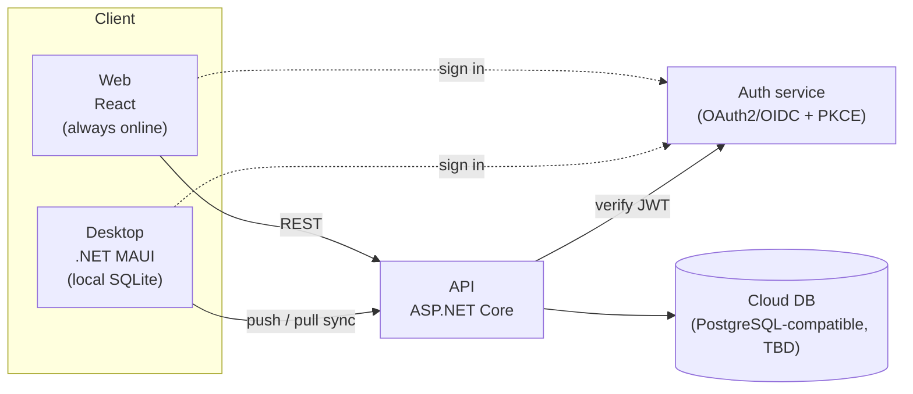
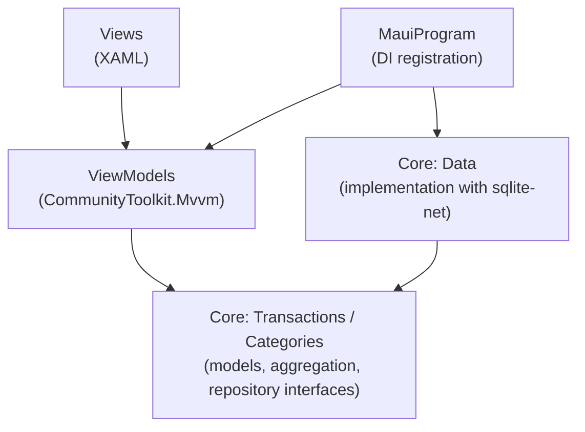
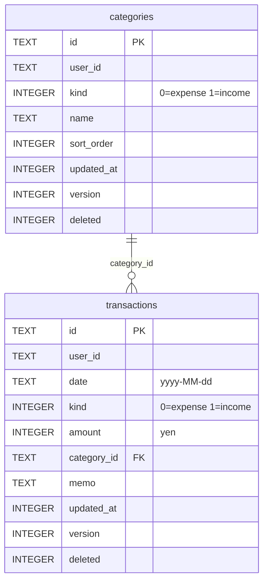

# Architecture

English | [日本語](architecture.ja.md)

This document describes the overall structure of the kakeibo (household budget book) app and its design decisions. Terms follow the [ubiquitous language](ubiquitous-language.md).

## Assumptions

- A personal project, distributed for free for now. Paid features will be added later
- Users sign in with an account
- Development happens on a Mac

## System overview

The target structure is shown below. **Only the desktop app (working offline) is implemented so far.**



| Layer | Technology | Role | Status |
|---|---|---|---|
| Desktop | C# / .NET 10 / .NET MAUI | Works on a local SQLite database and syncs with the API | In progress |
| API | ASP.NET Core | Token verification, CRUD, sync, aggregation | Not started |
| Cloud DB | TBD (PostgreSQL-compatible expected) | Source of truth for data | Not started |
| Web | React | Calls the API directly (assumes always online) | Not started |

Principles:

- Define the API contract with **OpenAPI** and generate the C# and React client code from it
- Keep important calculations such as aggregation **on the API side** to avoid implementing them twice
- **Only the desktop app** contains the sync logic

## Desktop app

### Target platforms

| OS | Support | Notes |
|---|---|---|
| macOS | Mac Catalyst | Used for day-to-day checks |
| Windows | WinUI | To be built on GitHub Actions Windows runners (not verified yet) |
| Linux | Not supported | Not supported by MAUI |
| iOS / Android | Undecided | To be decided later |

### Project structure

```
Kakeibo.slnx
├── src/
│   ├── Kakeibo.Core/          Domain and data access (no dependency on MAUI)
│   │   ├── Accounts/          Current user (ICurrentUser)
│   │   ├── Categories/        Categories
│   │   ├── Transactions/      Transactions and aggregation (ledger, yearly summary, category breakdown)
│   │   └── Data/              SQLite implementation (table rows, repositories, migrations)
│   └── Kakeibo.Desktop/       MAUI app (MVVM)
│       ├── ViewModels/
│       └── Views/
└── tests/
    └── Kakeibo.Core.Tests/    Unit tests for Core (using real SQLite files)
```

Dependencies only go `Desktop → Core`. Core does not reference MAUI, so it can be verified on a Mac with `dotnet test` alone.



### Main libraries

| Purpose | Library |
|---|---|
| Local DB | sqlite-net-pcl + SQLitePCLRaw.bundle_green (the native `SQLitePCLRaw.lib.e_sqlite3` is pinned to 3.53.3 to fix a known vulnerability) |
| MVVM | CommunityToolkit.Mvvm |
| Tests | xUnit, Microsoft.Extensions.TimeProvider.Testing (for a fixed clock) |

### Screens

Screens are switched from the sidebar on the left (a Shell flyout that is always shown).

| Screen | ViewModel | Contents |
|---|---|---|
| Transactions (明細) | `MonthlyTransactionsViewModel` | Month navigation, entry form (add/edit), ledger-style transaction list, monthly balance |
| Reports (集計) | `ReportViewModel` | Monthly trend for the year, category breakdown for the selected month |
| Settings (設定) | `CategorySettingsViewModel` | Add, rename, reorder, and delete categories |

Each screen reloads its data every time it appears (`OnAppearing`), so that changes made on other screens (such as renaming a category) are reflected.

## Data design

### Common rules

To prepare for sync, every table has the following columns.

| Column | Type | Description |
|---|---|---|
| `id` | TEXT (UUID) | Primary key. A UUID, so that rows created offline do not collide |
| `user_id` | TEXT | Owner. A fixed value `local` until sign-in is implemented |
| `updated_at` | INTEGER | Last update time (UTC Unix time in milliseconds). Used to resolve conflicts |
| `version` | INTEGER | 1 when created, incremented on every update |
| `deleted` | INTEGER (0/1) | Soft delete flag. Rows are never physically deleted, so that deletions can be sent to other devices |

- Amounts are stored as **integers in yen** (`long`). Fractions are not supported
- Dates are stored as `yyyy-MM-dd` strings, so a period can be searched by string comparison

### Tables



Constraints (validated by the app):

- A transaction's amount is at least 1 yen
- A transaction's category belongs to the same user and has the same kind (expense/income) as the transaction. Soft-deleted categories are allowed, so that transactions registered before the deletion can still be edited
- Category names are unique among the active categories of the same kind

### Schema versions and migrations

The schema version is managed with SQLite's `PRAGMA user_version`. `KakeiboDatabase` upgrades the database to the latest version on first access.

| Version | Changes |
|---|---|
| 0 | Transactions store the category name directly as a string (`category` column) |
| 1 | Adds the `categories` table; transactions reference it by `category_id`. Existing category names are mapped to the default category with the same name, or moved to a new category if there is none |

## Aggregation

Aggregation is implemented as pure functions in `Kakeibo.Core` and verified by unit tests.

| Aggregation | Class | Description |
|---|---|---|
| Ledger | `MonthlyLedger` | Sorts a month's transactions from oldest to newest and accumulates the balance from the carryover |
| Yearly summary | `YearlySummary` | Income, expenses, difference, and month-end balance for each month, plus yearly totals |
| Category breakdown | `CategoryBreakdown` | Total and share per category (largest amount first) |

The carryover balance (the net total of all transactions before a given date) is calculated with a SQL aggregate (`GetBalanceBeforeAsync`).

> The principle is to keep aggregation on the API side. For now it runs on the desktop so that the app works offline. Where to calculate it will be decided when the API is built (see Open questions).

## Sync (not implemented)

- Two sync APIs
  - **push**: send changes from the device to the server
  - **pull**: fetch changes since the last sync
- Conflicts are resolved by **taking the most recently updated row** (Last Write Wins). The same transaction is rarely edited on several devices at once, so this is sufficient

## Authentication (not implemented)

- Use a **managed auth service** instead of building one (Auth0, Supabase Auth, Cognito, etc. To be decided after choosing the DB)
- Browser-based sign-in with **OAuth2/OIDC (PKCE)**
  1. Sign in on the auth service's page and receive a JWT
  2. The app stores the token
  3. The API verifies the token on every request and extracts the `user_id`
- Consider social sign-in (Google, etc.)
- Provide a way to delete the account (and its data)
- Until sign-in is implemented, the desktop app uses `LocalUser` (`user_id = "local"`) as its `ICurrentUser`

## Distribution (not implemented)

- Start with **zip distribution** (self-contained publish)
- Consider **MSIX** or **Inno Setup** as the number of users grows
- Code signing (Windows code signing, Mac signing and notarization) will be handled when the app is made widely available. When sharing with friends and family, tell them in advance about the unsigned-app warning

## Milestones

The original order was "auth → API → desktop", but the desktop app is being built first.

- [x] Desktop: transaction CRUD (local SQLite)
- [x] Desktop: category management, reports screen
- [ ] Choose an auth service and get sign-in/sign-out working in React
- [ ] Build an ASP.NET Core API that verifies tokens and extracts `user_id`
- [ ] Build the transaction CRUD API and DB, and get it working on the web
- [ ] Add sign-in to the desktop app and connect it to the API
- [ ] Implement push/pull sync
- [ ] Get Windows/Mac builds passing on GitHub Actions (do this early once, to avoid rework)
- [ ] Distribute as a zip to friends and family

## Open questions

| Item | Notes |
|---|---|
| Choice of cloud DB | Supabase's free tier pauses after a week of inactivity, so at launch either move to Pro or consider another service |
| Choice of auth service | Depends on the DB |
| Where to calculate aggregation | Currently on the desktop (Core). Needs to be reconciled with the principle of keeping it on the API side |
| Duplicate default categories | Default categories get a different UUID on each device, so syncing creates duplicate categories with the same name. Address this when implementing sync |
| Mobile (iOS/Android) support | Whether and when |
| Monetization | Subscription or one-time purchase |
| Chart and list libraries | For now, simple bar charts are drawn with the standard MAUI ProgressBar |
